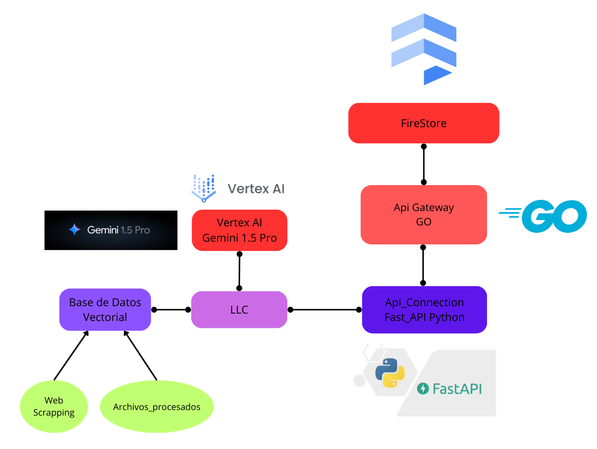

# Banorte

## Desarrollo

### Prerequisitos

- [Docker](https://docs.docker.com/engine/install/)
- [Git](https://git-scm.com/downloads)
- [VSCode](https://code.visualstudio.com/download)
- [Python](https://www.python.org/downloads/)
- [FastApi](https://fastapi.tiangolo.com/#installation)
- [Ollama](https://ollama.com/)
- [Golang](https://golang.org/doc/install)
- [Nodejs](https://nodejs.org/en/download/package-manager)
- [Dart](https://dart.dev/get-dart)
- [Flutter](https://docs.flutter.dev/get-started/install)
- [Vertex](https://cloud.google.com/vertex-ai?hl=es-419)

### Desarrollo

1. Clona el repositorio

```bash
git clone https://github.com/zam-cv/banorte
```

2. Entra a la carpeta de la aplicacion

```bash
cd app\
```

3. Instala dependencias de Flutter

```bash
flutter pub get
```

4. Abra otra terminal en el directorio raiz del proyecto y acceder a `llm`

```bash
cd llm\
```

5. Corra los archivos de instalacion de dependencias. 

Si estas en Windows corre el siguiente comando.

```bash
llm/install_dependencies.bat
```

Si estas en Mac o Linux corre el siguiente comando.

```bash
llm/install_dependencies.sh
```
6. Descargar y autenticarte con google SDK


7. Create a `.env` file in the `api_gateway` directory with the following content

```bash
PORT=3000
SECRET_KEY=secret_key
LLM_HOST=127.0.0.1
LLM_PORT=8000
```

8. Correr los servidores en el siguiente órden.

```bash
ollama run gemma2:9b
```

```bash
python3 api_connection.py
```

```bash
cd api_gateway
go run main.go
```

```bash
docker run -p 8080:8080 -p 50051:50051 cr.weaviate.io/semitechnologies/weaviate:1.24.8
```

9. Correr la aplicación con flutter
```
cd app
flutter run
```

#### Diagrama de componentes

